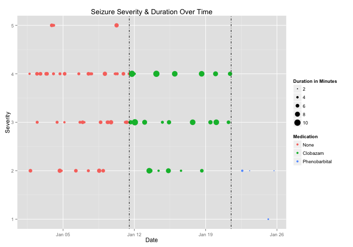
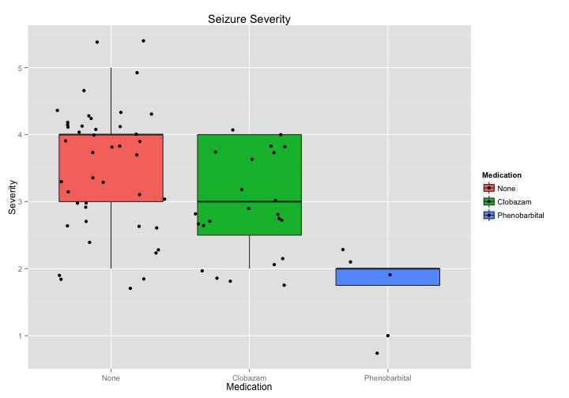
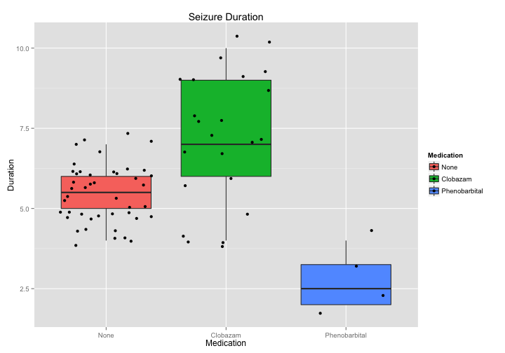
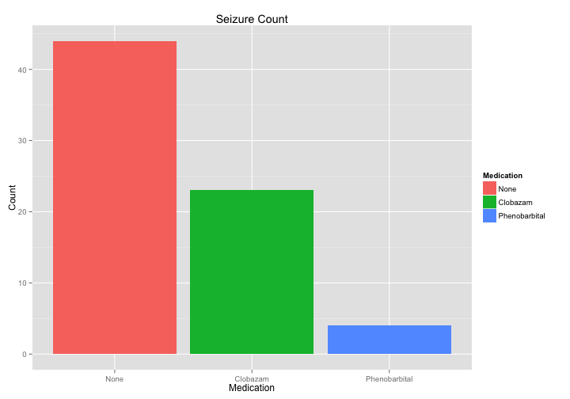

# Aggregate Seizure Report

**Patient**: John Doe

**Report Date**: April 22, 2015

## Seizure Summary
<!-- html table generated in R 3.1.2 by xtable 1.7-4 package -->
<!-- Mon Apr 27 22:52:50 2015 -->
<table border=1>
<tr> <th> Medication </th> <th> Daily_Frequency </th> <th> Total </th> <th> Mean_Severity </th> <th> SD_Severity </th> <th> Mean_Duration </th> <th> SD_Duration </th> <th> Start_Date </th>  </tr>
  <tr> <td> None </td> <td align="right"> 4.40 </td> <td align="right">  44 </td> <td align="right"> 3.48 </td> <td align="right"> 0.88 </td> <td align="right"> 5.45 </td> <td align="right"> 0.90 </td> <td> 2015-01-01 </td> </tr>
  <tr> <td> Clobazam </td> <td align="right"> 2.30 </td> <td align="right">  23 </td> <td align="right"> 3.04 </td> <td align="right"> 0.77 </td> <td align="right"> 7.26 </td> <td align="right"> 2.03 </td> <td> 2015-01-11 </td> </tr>
  <tr> <td> Phenobarbital </td> <td align="right"> 0.40 </td> <td align="right">   4 </td> <td align="right"> 1.75 </td> <td align="right"> 0.50 </td> <td align="right"> 2.75 </td> <td align="right"> 0.96 </td> <td> 2015-01-21 </td> </tr>
   </table>

## Figures
#### Seizures Over Time

#### Severity

#### Duration

#### Frequency

