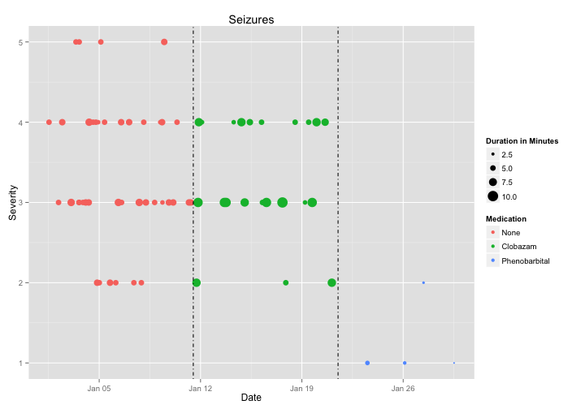

# Epilepsy Report Demo

**Patient**: John Doe

**Report Date**: April 22, 2015

## Seizure Summary
<!-- html table generated in R 3.1.2 by xtable 1.7-4 package -->
<!-- Thu Apr 23 00:44:44 2015 -->
<table border=1>
<tr> <th> Medication </th> <th> Frequency </th> <th> Average_Severity </th> <th> SD_Severity </th> <th> Average_Duration </th> <th> SD_Duration </th> <th> Start_Date </th>  </tr>
  <tr> <td> None </td> <td align="right"> 4.40 </td> <td align="right"> 3.34 </td> <td align="right"> 0.83 </td> <td align="right"> 5.34 </td> <td align="right"> 0.86 </td> <td> 2015-01-01 </td> </tr>
  <tr> <td> Clobazam </td> <td align="right"> 2.30 </td> <td align="right"> 3.30 </td> <td align="right"> 0.70 </td> <td align="right"> 6.87 </td> <td align="right"> 1.98 </td> <td> 2015-01-11 </td> </tr>
  <tr> <td> Phenobarbital </td> <td align="right"> 0.40 </td> <td align="right"> 1.25 </td> <td align="right"> 0.50 </td> <td align="right"> 2.50 </td> <td align="right"> 1.29 </td> <td> 2015-01-21 </td> </tr>
   </table>

