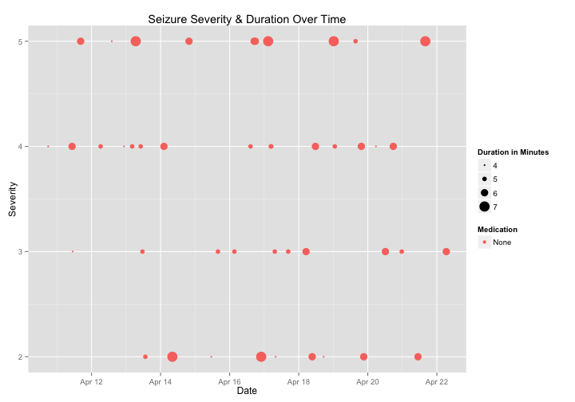
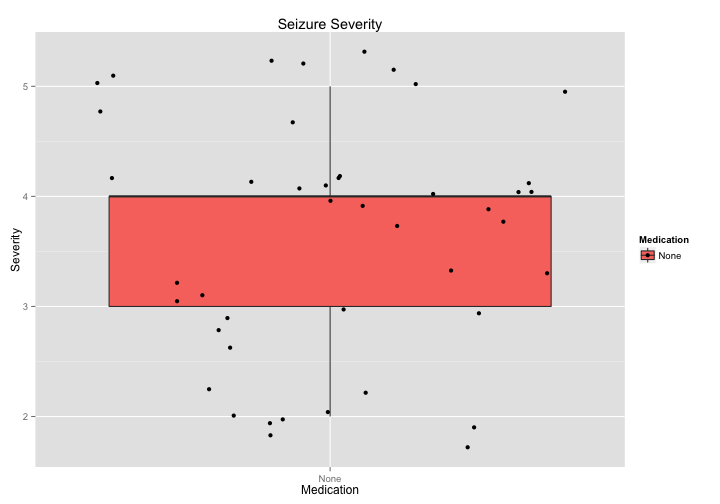
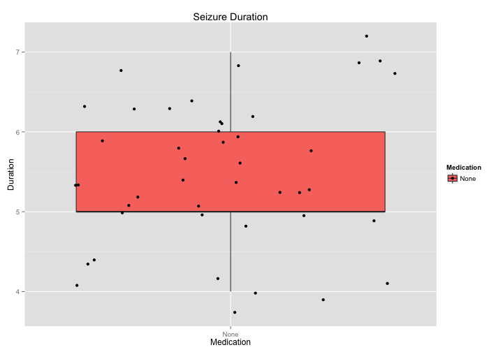

# Epilepsy Report 
## Seizure Activity Since Last Visit

**Patient**: John Doe

**Report Date**: April 22, 2015

## Seizure Summary
<!-- html table generated in R 3.1.2 by xtable 1.7-4 package -->
<!-- Mon Apr 27 22:52:30 2015 -->
<table border=1>
<tr> <th> Medication </th> <th> DailyFrequency </th> <th> Total </th> <th> Mean_Severity </th> <th> SD_Severity </th> <th> Mean_Duration </th> <th> SD_Duration </th>  </tr>
  <tr> <td> None </td> <td align="right"> 4.40 </td> <td align="right">  44 </td> <td align="right"> 3.59 </td> <td align="right"> 1.06 </td> <td align="right"> 5.43 </td> <td align="right"> 0.95 </td> </tr>
   </table>

## Figures
#### Seizures Over Time

#### Severity

#### Duration

